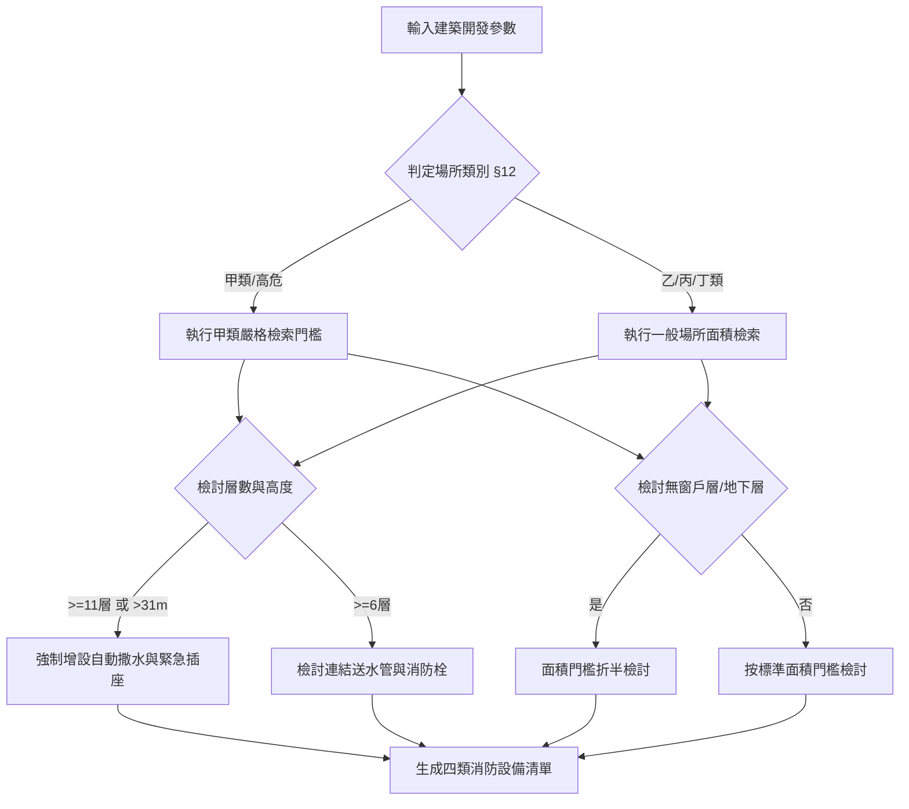

# 各類場所消防安全設備設置檢討

在台灣的建築設計與建設開發流程中，決定一棟建築物需要配置哪些消防設備，是建築設計初期（Sketch 與都審階段）至為關鍵的節點。消防設備的設置不僅大幅影響機房空間、管道間尺寸與工程造價，更是建築執照審查時的「一票否決」項目。

本篇提供了一套結構化的消防安全設備法規檢討流程，並隨附一個互動式檢討網頁工具，讓設計人員能透過輸入建築基本參數，快速生成應設消防設備清單。

---

## 學習目標

1. **理解台灣消防安全設備的四大分類**：滅火、警報、避難逃生、消防搶救。
2. **掌握影響消防設備設置的五大關鍵因子**：用途分類、總樓地板面積、層數與高度、無窗戶層認定、地下層與避難層。
3. **學會使用互動式檢討工具**，在設計初期快速評估消防設備配置需求與法規臨界點。

---

## 消防設備檢討的五大核心因子

在進行消防檢討時，必須先釐清以下五個維度的資訊，任何一項參數的變動都可能觸發全新的設備需求：

### 1. 場所用途分類（各類場所消防安全設備設置標準 §12）
法規將建築物用途細分為五大類（甲、乙、丙、丁、戊）：
* **甲類**：高風險與高人員密度場所（如電影院、KTV、商場、餐廳、旅館、醫院、療養院等）。其設置門檻最為嚴格。
* **乙類**：中低風險場所（如學校、辦公室、體育館、展覽場、住宅等）。
* **丙類**：工業場所（如廠房、作業廠、倉庫）。
* **丁類**：車輛與危險物品場所（如室內停車場、飛機庫）。
* **戊類**：複合用途建築物、其他特定場所。

### 2. 層數與建築物高度
* **高層建築（高度超過 31 公尺或 11 層樓以上）**：幾乎強制要求裝設**自動撒水設備**與**緊急電源插座**。
* **中高層建築（6 層樓以上）**：觸發**室內消防栓**與**連結送水管**的設置機率極高。

### 3. 樓地板面積（單層、特定層與總面積）
法規條文多以「總樓地板面積」或「特定樓層面積」作為門檻。例如：
* 甲類場所總樓地板面積達 **150 m²** 觸發火警自動警報與滅火器。
* 乙類場所總樓地板面積達 **500 m²** 觸發火警自動警報。

### 4. 無窗戶層（Windowless Floor）認定
指建築物各層無直通戶外之開口，或其開口面積未達該層樓地板面積 **百分之五**。
* ⚠️ **法規陷阱**：一旦被認定為「無窗戶層」，許多設備（如室內消防栓、火警警報、排煙設備）的免設面積門檻會**直接減半**甚至**強制設置**。

### 5. 地下層與避難層
* **地下層**因避難動線差、排煙不易，設置標準遠比地上層嚴格（例如地下層面積達 1,000 m² 即強制設置自動撒水）。

---

## 消防搶救與安全設備設置節點流程

以下為一個開發案進來後的消防設備法規檢討邏輯節點：

---

## 相關法規與延伸技能

1. **《各類場所消防安全設備設置標準》**
   * 第二編 第一章：滅火設備（§14 ~ §30）。
   * 第二編 第二章：警報設備（§112 ~ §128）。
   * 第二編 第三章：避難逃生設備（§146 ~ §157）。
   * 第二編 第四章：消防搶救必要設備（§175 ~ §192）。
2. **延伸閱讀技能**：
   * [sprinkler-foam-piping-review](../灑水與泡沫滅火系統配管檢討/sprinkler-foam-piping-review/SKILL.md) — 消防撒水與泡沫管徑與頭數檢討。
   * [smoke-exhaust-review](../排煙窗法規檢討/smoke-exhaust-review/SKILL.md) — 排煙窗有效面積與排煙區劃檢討。
